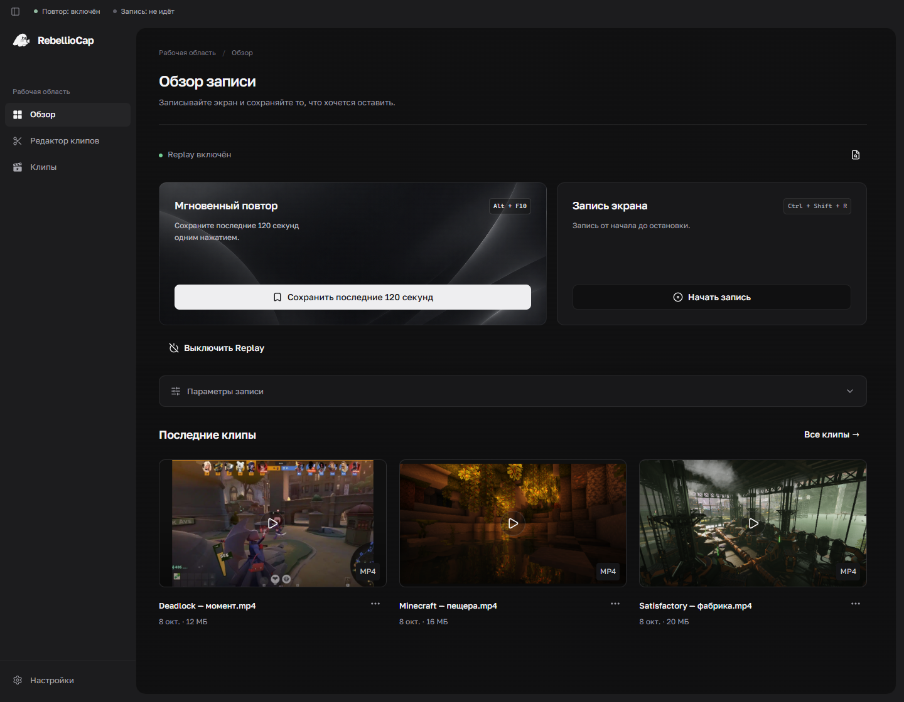
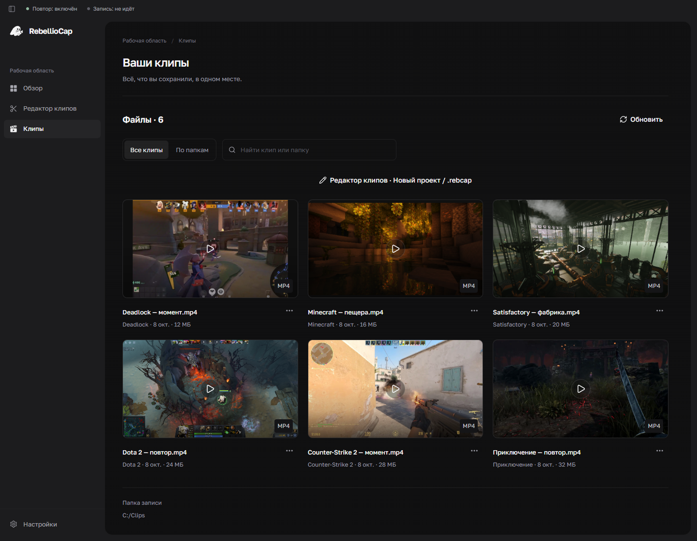
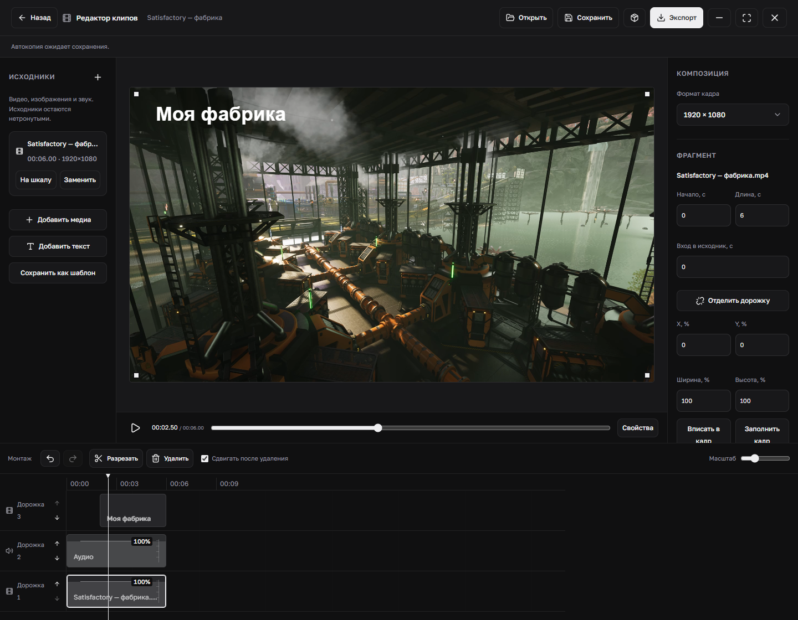
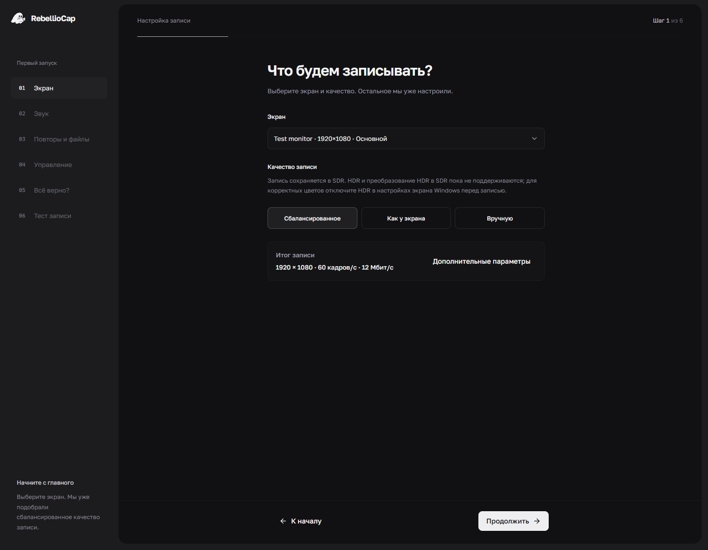
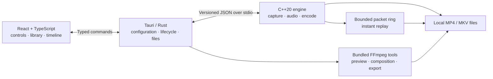

<div align="center">


# RebellioCap

**Capture the moment. Keep the context.**

Gameplay recording, instant replay, and a built-in clip editor for Windows.

[](https://github.com/kirzep/RebellioCap/actions/workflows/desktop-ci.yml)


[Get started](docs/getting-started.md) · [Requirements](docs/system-requirements.md) · [Help](docs/troubleshooting.md) · [Documentation](docs/README.md)

**English** · [Русский](README.ru.md)

</div>



*Current application UI with supplied gameplay images and demonstration clip data; [screenshot details](docs/screenshots/README.md). The application interface is currently in Russian.*

## Save what just happened

RebellioCap keeps a rolling history of your gameplay so you can save a moment **after it happens**. Record a full session, keep instant replay running alongside it, then review and edit clips in the same application. Your recordings stay on your machine.

| Feature | What you can do |
| --- | --- |
| **Instant replay** | Save the recent recording window with a hotkey. Set its duration and RAM budget. |
| **Continuous recording** | Record to MP4 or MKV while replay runs alongside it. |
| **Hardware encoding** | Capture a display using D3D11 and NVIDIA NVENC H.264. |
| **Audio control** | Capture system audio and an optional microphone, with mixed and separate tracks when both sources are enabled. |
| **Clip library** | Browse local recordings, categories and thumbnails; preview clips and select audio tracks. |
| **Built-in editor** | Trim, split and arrange clips; add images and text; adjust framing, color and audio gain. |
| **Export** | Create H.264/AAC video with configurable quality and file-size targets. Save projects and templates. |
| **Desktop controls** | Use global hotkeys, tray controls, optional Windows startup, and notification preferences. |
| **Recovery** | Resume capture after supported display interruptions, discover eligible partial recordings, and recover editor autosaves. |

Capture records the selected **display**, including anything visible on it. Game categories organize files; the current implementation does not inject into games or isolate audio by process.

## From recording to finished clip

### Find a moment



Browse recordings and replays, preview a clip, and choose which audio tracks to hear.

### Make the cut



Arrange video and audio on a timeline, add layers, and export without leaving the application.

<details>
<summary><strong>Guided setup</strong> — display, audio, replay, hotkeys, and a test recording</summary>

<br>


Setup checks devices, the native engine, available memory, and output-folder access before applying a configuration.

</details>

## Getting started

This repository currently publishes **development source**. The desktop package declares version `0.1.7`; a verified binary release is a separate milestone. Check [GitHub Releases](https://github.com/kirzep/RebellioCap/releases) for explicitly published downloads and [release policy](docs/releases.md) for their acceptance requirements.

The recording path requires **Windows x64**, an **NVIDIA GPU with compatible NVENC H.264 support**, and **WebView2**. See [system requirements](docs/system-requirements.md) before building. Development also needs MSVC C++ Build Tools with the Windows SDK and CMake/Ninja, Node.js 24 with npm, and Rust 1.89 or newer with the MSVC target.

From PowerShell:

```powershell
git clone https://github.com/kirzep/RebellioCap.git
Set-Location RebellioCap

# Check prerequisites and restore dependencies.
./scripts/verify-prerequisites.ps1
./scripts/bootstrap-vcpkg.ps1
npm ci

# Build and stage the native engine.
./scripts/invoke-dev.ps1 -Command @('cmake', '--preset', 'windows-debug')
./scripts/invoke-dev.ps1 -Command @('cmake', '--build', '--preset', 'windows-debug')
./scripts/stage-desktop-engine.ps1 -BuildDirectory build/windows-debug

# Launch the desktop application.
npm run desktop:dev
```

Wait for each command to succeed before continuing. The [step-by-step guide](docs/getting-started.md) covers tool installation, first-run setup, your first recording, and frontend-only development.

### Default hotkeys

| Action | Shortcut |
| --- | --- |
| Save instant replay | **Alt + F10** |
| Toggle continuous recording | **Ctrl + Shift + R** |

You can change both shortcuts in the application. Replay saves the footage still retained in its buffer; new sessions or long interruptions can produce shorter clips.

## Requirements and current limitations

- **Windows x64 + NVIDIA NVENC:** AMD/Intel capture encoders and other operating systems are not implemented. Driver/API and encoder-capability checks must pass for the selected settings.
- **SDR video:** recordings use BT.709. HDR fidelity and tone mapping are not implemented.
- **Memory and storage:** replay stores encoded packets in RAM. Recording space depends on bitrate and duration; see the [sizing examples](docs/system-requirements.md#size-the-recording-workload).
- **Interrupted capture:** an unavailable display interval cannot be reconstructed. Partial-file recovery cannot restore bytes that were never written.
- **Compatibility:** configuration limits do not promise that every GPU can sustain the maximum resolution/FPS. Broad hardware, performance, and installer acceptance require separate checks.
- **Sharing:** project files and diagnostics can contain local paths. Review them before posting. See [privacy](docs/privacy.md).

## For developers

The native C++20 engine owns capture, audio, encoding, replay, and muxing. A Rust/Tauri host supervises the engine and owns configuration and file access. React/TypeScript provides the interface, library, and timeline editor. Bundled FFmpeg tools handle editor preview and export.



The [architecture guide](docs/architecture.md) explains GPU resource ownership, shared audio/video clocks, replay memory limits, process boundaries, and recovery behavior, with links to implementation and tests.

| Area | Location |
| --- | --- |
| Native capture, audio, encoding, replay, muxing | [`src/`](src/) |
| Desktop UI, onboarding, library, editor | [`apps/desktop/src/`](apps/desktop/src/) |
| Rust host, process supervision, media orchestration | [`apps/desktop/src-tauri/`](apps/desktop/src-tauri/) |
| Shared recording validation | [`contracts/`](contracts/) |
| Native and script tests | [`tests/`](tests/) |
| Build, staging, recovery and measurement tools | [`scripts/`](scripts/) |

### Run checks

```powershell
# C++, Rust, frontend checks, production bundle, and CSP assertion.
./scripts/verify-desktop.ps1

# Browser acceptance is a separate gate.
npx playwright install chromium
npm run test:e2e -w @rebelliocap/desktop

# Crash-media coverage verifier tests.
npm run test:crash-coverage
```

The [Windows CI workflow](.github/workflows/desktop-ci.yml) runs software and browser checks. Browser fixtures exercise UI behavior; actual WebView2, GPU capture, device recovery, long sessions, and installers have separate validation requirements. See [testing](docs/testing.md) for commands and coverage boundaries.

## Documentation and help

[Documentation index](docs/README.md) · [Troubleshooting](docs/troubleshooting.md) · [Support](SUPPORT.md) · [Changelog](CHANGELOG.md)

[Contributing](CONTRIBUTING.md) · [Security reports](SECURITY.md) · [Privacy](docs/privacy.md) · [Community expectations](CODE_OF_CONDUCT.md)

## Licensing

The source is publicly available for inspection. **No project-wide open-source license is currently granted.** See [licensing status](LICENSE.md). Third-party components retain their own licenses and notices; their details and redistribution boundaries are recorded in [third-party licenses](docs/licenses/third-party.md).
