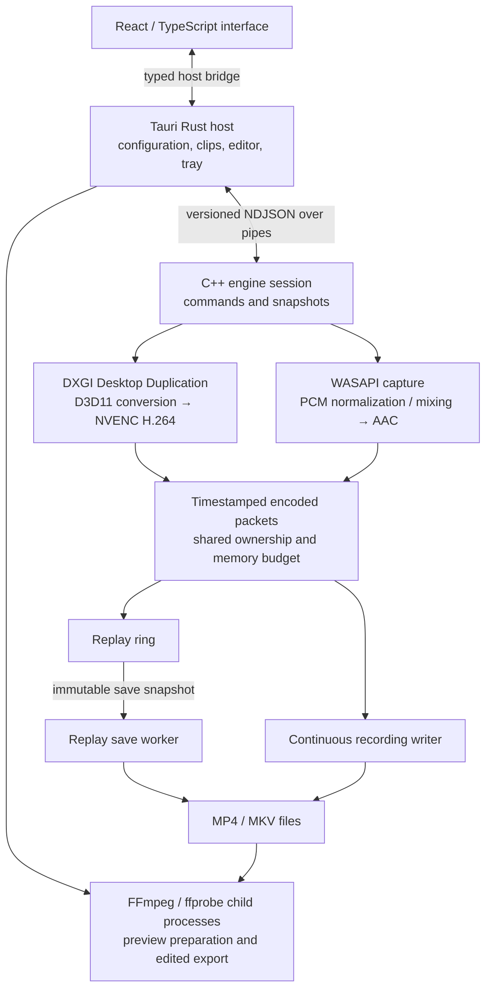

# Architecture

RebellioCap separates desktop interaction from the Windows capture pipeline.
React renders the interface, the Tauri Rust host owns configuration and native
operations, and a C++20 child process captures and encodes media. The engine is
also usable through its CLI, which lets tests exercise recording without a
WebView.

## Process and data flow

The recording path uses FFmpeg libraries for muxing already encoded packets.
The editor uses the staged FFmpeg executables for media processing. These are
separate paths: replay saving does not re-encode the captured video.

## Responsibilities

| Layer | Responsibilities | Entry points |
| --- | --- | --- |
| Desktop interface | Onboarding, recording controls, gallery, playback, editor interaction | [host bridge](../apps/desktop/src/bridge/host.ts), [editor model](../apps/desktop/src/editor/model.ts) |
| Rust host | Validate and persist settings; own engine and editor processes; mediate file access; expose commands | [commands](../apps/desktop/src-tauri/src/commands.rs), [engine supervisor](../apps/desktop/src-tauri/src/engine/supervisor.rs), [editor](../apps/desktop/src-tauri/src/editor.rs) |
| C++ session | Serialize control commands, publish state, correlate save completions | [session controller](../src/engine/session_controller.cpp), [session loop and hardware factory](../src/engine/hardware_pipeline_factory.cpp) |
| Recording engine | Schedule video, pump audio, dispatch hotkeys, maintain replay, queue saves and continuous writes | [recorder engine](../src/engine/recorder_engine.cpp), [continuous recording](../src/engine/continuous_recording.cpp) |
| Platform adapters | Capture devices, GPU conversion, hardware encoding, containers | [capture](../src/capture/dxgi_capture_source.cpp), [audio](../src/audio/wasapi_capture_source.cpp), [NVENC](../src/video/nvenc_encoder.cpp), [muxers](../src/mux/ffmpeg_continuous_muxer.cpp) |

The engine depends on clock, pipeline, hotkey and muxer interfaces through
[RecorderEngineDependencies](../src/engine/recorder_engine.h). Tests substitute
those dependencies to simulate delayed encoding, blocked disk writes and
device outages without adding production fault-control switches.

## Control boundary

The host launches the canonical engine executable with explicit arguments and
places it in a Windows Job Object before resuming it. Closing the job terminates
owned processes. The supervisor serializes requests through an actor and waits
for events or request deadlines; it does not periodically poll an idle session.

The [C++ protocol](../src/engine/session_protocol.h) and
[Rust protocol](../apps/desktop/src-tauri/src/engine/protocol.rs) use protocol
version 1, request IDs and newline-delimited JSON frames limited to 64 KiB.
Malformed frames, incompatible versions and invalid response sequences are
errors. A replay save has two distinct events: acceptance (`command_result`)
and completion (`clip_saved` or an error). Acceptance alone does not establish
that a file exists. See the [protocol tests](../apps/desktop/src-tauri/tests/protocol.rs)
and [supervisor tests](../apps/desktop/src-tauri/tests/supervisor.rs).

Recording ranges and default hotkeys come from one
[JSON contract](../contracts/recording-settings.v1.json), consumed by C++, Rust
and TypeScript. The Rust host validates settings before turning them into
engine configuration. Its [configuration store](../apps/desktop/src-tauri/src/config/store.rs)
tracks onboarding drafts separately from active settings, binds test-recording
evidence to the tested configuration, and maintains a backup during replacement.
The [configuration tests](../apps/desktop/src-tauri/tests/config.rs) cover stale
evidence, corrupt files, future schemas and failed replacements.

## Media timing and ownership

Video remains in D3D11 textures through capture, scaling, rotation and conversion
to NV12 before NVENC submission. A latest-frame GPU cache allows the scheduled
encoder to reuse unchanged desktop content. Frame leases keep textures alive
while GPU work still references them; the [DXGI lifetime tests](../tests/unit/dxgi_frame_lifetime_test.cpp)
and [NVENC state tests](../tests/unit/nvenc_state_machine_test.cpp) exercise those
ownership transitions. If driver completion cannot be established during
shutdown, NVENC retains unsafe-to-release resources and requires a process
restart instead of freeing in-flight GPU resources. The tradeoff is retained
resources until process exit; see [shutdown tests](../tests/unit/nvenc_shutdown_test.cpp).

Audio and video share the QueryPerformanceCounter (QPC) timeline. Video deadlines
are calculated from a frame index and origin, so rounding does not accumulate
through repeated sleeps. Actual capture work uses the current clock; missed
deadlines are counted and skipped. Audio is normalized and aligned in bounded
PCM windows before AAC encoding. With both sources enabled, files contain a
mixed track plus separate system and microphone tracks. Source tracks are
encoded before their copies enter the bounded mixing queue, so a mixing overrun
does not discard the independent source audio.

[EncodedPacket](../src/media/encoded_packet.h) carries presentation time, decode
time, duration, keyframe status and a capture epoch. The
[replay ring](../src/replay/replay_ring.cpp) starts saves at a preceding keyframe
and retains the decode references needed by reordered pictures, even when a
reference has a later presentation time than the requested clip end. Snapshots
share immutable compressed payloads and own their packet metadata. New capture
epochs keep a resumed session from combining incompatible buffered intervals.
See [replay tests](../tests/unit/replay_ring_test.cpp) and
[scheduler tests](../tests/unit/engine_scheduler_test.cpp).

## Storage, backpressure and idle behavior

Capture workers hand packets to the replay ring and continuous writer. Replay
saves run on a separate worker; their destination category and naming preset
are frozen at the request boundary. The default limit is 16 outstanding saves,
including the active write. Continuous recording has its own writer and a
4,096-packet queue. Slow storage can therefore produce a visible queue or memory
error without making capture wait for the disk operation.

One [packet memory budget](../src/media/packet_memory_budget.h) accounts for
retained compressed allocations across replay, pending snapshots and continuous
recording. Shared payloads are charged once; snapshot metadata is also reserved.
The [budget policy](../src/engine/packet_budget_policy.h) selects an automatic
limit from available RAM or validates a manual limit. Under pressure, replay
evicts complete GOPs and may retain less than the requested duration; continuous
recording stops with an error if it cannot accept more packets. This budget is
not a process-memory cap: GPU surfaces, codecs, PCM and other allocations are
outside it.

When replay and continuous recording are both off, capture workers flush and
release their pipelines while control and already queued saves remain alive.
Resuming creates fresh hardware sessions and requests a keyframe. This avoids
keeping capture resources active solely to display the desktop controls.

Muxers create sibling temporary files without replacing an existing destination.
Successful finalization flushes and renames the file. Continuous MP4 uses
keyframe fragments; a failed or interrupted write may leave a `.partial` file
containing completed media. This is a recovery opportunity, not a guarantee
that the final fragment or every interrupted file is playable. See
[continuous recording tests](../tests/unit/continuous_recording_test.cpp) and
[crash verification](../scripts/verify-crash-media.mjs).

## Recovery and operational limits

Expected display transitions recreate Desktop Duplication with paced retries
for the selected monitor identity. During unavailability the engine emits no
new video packets and discards cached content; restoration requests a keyframe.
Input geometry and rotation can rebuild the converter while keeping configured
output dimensions and the encoder stable. Recoverable audio endpoint loss
retries the pinned device and supplies timestamped silence while unavailable.
Device removal, encoder failures and unrelated errors remain visible failures.
See [capture recovery](capture-recovery-testing.md) for the manual checks.

The host grants asset access to specific prepared playback and editor files,
then revokes it when their owner releases them. Editor imports and exports have
deadlines, cancellation and owned child processes; preview lifetime is separate
from original media and export lifetime. Tests cover cancelled publication,
scope rollback and cleanup in the [editor implementation](../apps/desktop/src-tauri/src/editor.rs).

This design targets Windows x64 and NVIDIA encoding. Deterministic tests cannot
establish compatibility with every display, audio driver, HDR configuration or
game. [Testing](testing.md) distinguishes those tests from real hardware and
long-session acceptance.
